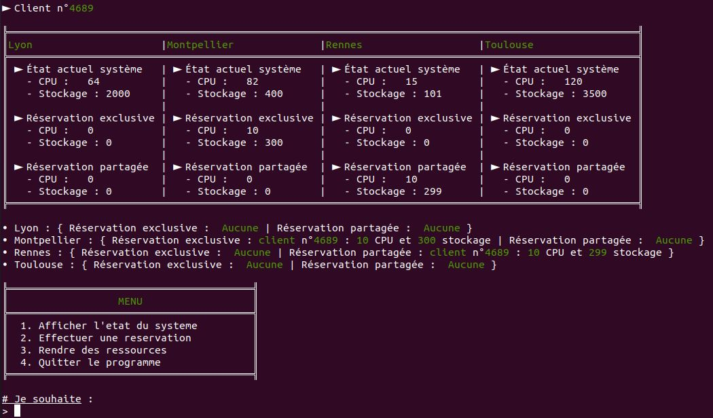
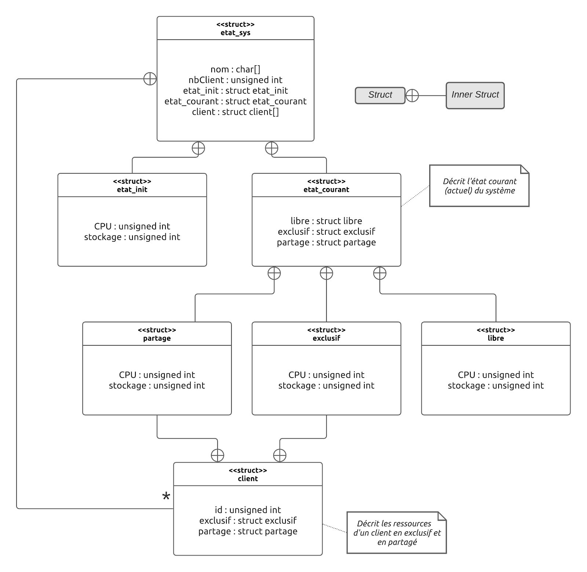
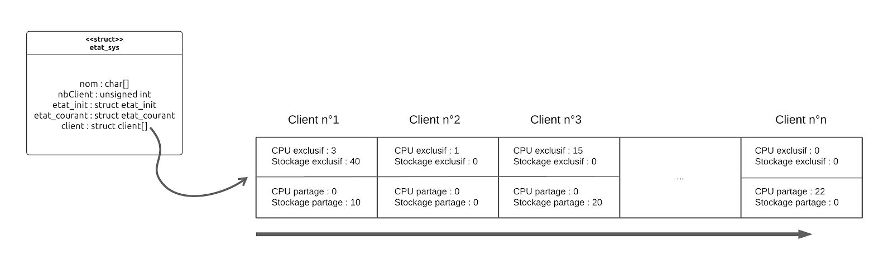
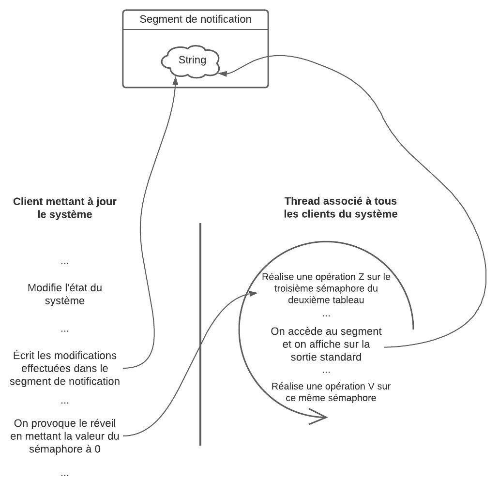

# Système de réservation distribué

## Screenshots

  
   
   
   

## Description 
L’idée de ce projet s’inspire d’un système de réservation de ressources de calcul et/ou de
stockage sur une plateforme de grille ou de cloud. Il a pour objectif de permettre à des clients de
louer des puissances de calcul ou des espaces de stockage distants répondant à des besoins
spécifiques (exemple : exécuter une simulation scientifique sur une architecture distribuée de
processeurs et de mémoire pour stocker (le temps de la location) les données traitées et
produites).
Dans le système à mettre en œuvre, un client aura la possibilité de louer des ressources, soit en
mode exclusif (les ressources louées sont utilisées par un seul client pendant toute la durée de la
réservation), soit en mode partagé (les ressources louées peuvent être utilisées en même temps
par plusieurs clients).